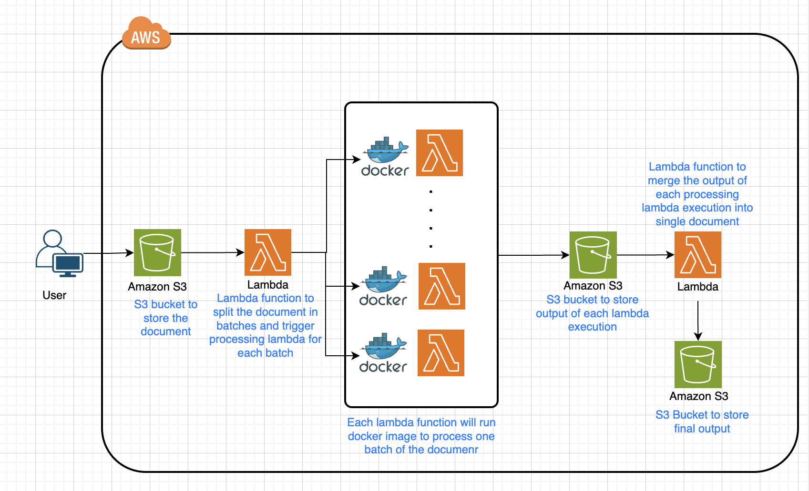

# AWS PDF Batch Processing Pipeline

## Overview
This project provides a scalable architecture for processing large PDFs and correcting their orientation using AWS Lambda functions. It uses batch processing to handle larger files and combines the outputs of the batches into a final processed PDF.

## Architecture

- **S3 Event Trigger**: When a PDF is uploaded to the designated S3 bucket, an event triggers the initial Lambda function.
- **Batch Creation Lambda**: This Lambda function breaks the PDF into batches for efficient processing, particularly useful for large files.
- **Processing Lambda (ECR-based)**: Each batch is processed by a separate Lambda function that runs a Docker image hosted in AWS ECR. The Docker container contains a PDF processing script to rotate or correct the orientation.
- **Combining Lambda**: After all batches are processed, this Lambda function combines the outputs into the final processed PDF and stores it back in the S3 bucket.

## Prerequisites